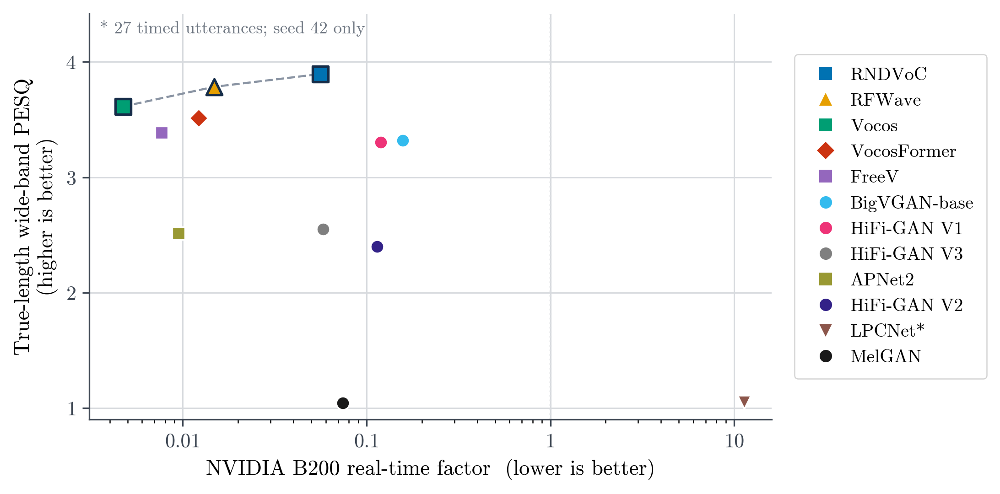
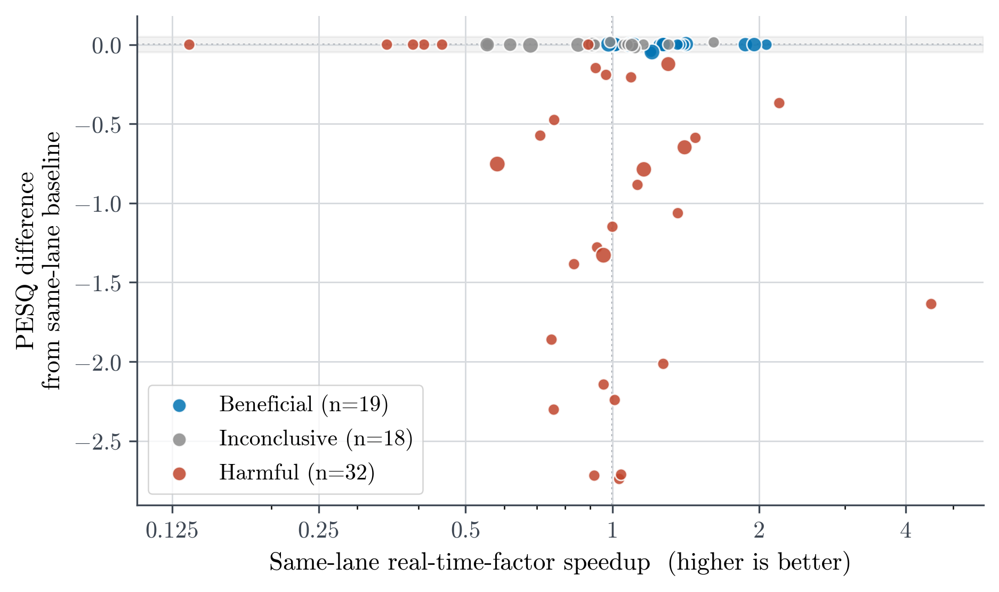

# VOCODE: Efficient Neural Vocoders

A systematic evaluation of quality, efficiency, and deployment trade-offs in neural vocoders.

Neural vocoders differ sharply in quality, speed, and footprint, yet published results resist comparison because corpus, training budget, implementation, evaluator, and hardware vary across papers. VOCODE benchmarks twelve neural vocoders spanning autoregressive, GAN-based, iSTFT-based, flow-matching, and attention-augmented designs. Every configuration is trained from scratch on LJSpeech with architecture-native objectives and identical data splits, evaluated under one measurement protocol, and then subjected to executed deployment transformations (compilation, FP16 weight casting, INT8 quantization, ONNX export, magnitude pruning, and ODE step reduction). Every transformed artifact is judged against a baseline on identical hardware under an explicit decision rule.

This repository carries the complete source code and the complete measured evidence of the study. Every number reported in the accompanying fifteen-page report was measured by the code in `code/` and traces to an on-disk record in `artifacts/`.

## Course Context

| Field | Value |
|---|---|
| Course | Biomedical Image Analysis Project |
| Programme | M.Sc. Data Science, Friedrich-Alexander-Universität Erlangen-Nürnberg |
| Lab | AI in Communication Disorders, Department of AI in Biomedical Engineering |
| Semester | Summer semester 2026 |
| Author | Rahul Sawhney (rahul.sawhney@fau.de) |
| Supervisor | Nina Goes |
| Professor | Prof. Dr. Andreas Kist |

## Project Structure

```
code/              Complete source: training framework, study client, test suite, cloud scheduling
artifacts/         Complete measured evidence: experiment registers, run records, execution logs, figures
docs/              The report (PDF and LaTeX source), the final presentation, and the technical guides
README.md          This document
requirements.txt   The pinned dependency set of the study's container image
LICENSE            MIT license for the source code and documentation
CITATION.cff       Citation metadata for this repository
```

The directories are complementary parts of one study. `code/` contains everything that computes and nothing that was measured, while `artifacts/` contains everything that was measured and nothing that computes. The report, shipped under `docs/report/`, is the written synthesis of both: its methodology chapters describe the machinery in `code/`, and its results chapters are derived from the registers in `artifacts/`.

| Path | Contents |
|---|---|
| `code/syntheticmind/` | A study-agnostic PyTorch training framework providing the trainer, loops, accelerators, strategies, callbacks, loggers, and resumable checkpoint state. |
| `code/vocode/` | The study client: the twelve vocoder architectures, their objectives, the LJSpeech data pipeline, the measurement stack, the deployment transformations, and the evidence-writing command-line interface. |
| `code/tests/` | The permanent offline test suite of 2,202 tests plus 42 subtests, mirroring `code/vocode/` directory for directory. |
| `code/modal/` | Cloud scheduling for Modal: the container image, the volume contract, the launch entrypoints, and the storage and synchronization utilities. |
| `artifacts/study_1/` | Evidence for the training reproduction study: twelve from-scratch baselines with training histories and seed-level evaluations. |
| `artifacts/study_2/` | Evidence for the deployment optimization study: intervention results paired with same-hardware baselines, and the exclusion register. |
| `artifacts/study_3/` | Evidence for the cross-model synthesis: fidelity and efficiency frontiers, intervention registers, and selection results. |
| `docs/report/` | The fifteen-page report as `report.pdf` with its complete LaTeX source. |
| `docs/presentation/` | The final project presentation as delivered for this course. |
| `docs/guides/` | Eleven technical guides covering the architecture, data, configurations, training, metrics, deployment, experiments, evidence verification, cloud execution, and reproduction. |

Every code and artifacts directory carries its own `README.md` describing exactly what it contains, and `docs/README.md` indexes the documentation.

## Requirements

The project targets Python 3.14, and the study executed on Python 3.14.2. The core dependency is PyTorch 2.13.0 with torchaudio 2.11.0; cloud executions used the CUDA 13.0 build, while the CPU build is sufficient for the test suite and for local CPU evaluation. The deployment backends are torchao 0.17.0, ONNX 1.20.1, and ONNX Runtime 1.24.4. The metric stack consists of pesq 0.0.4, pystoi 0.4.1, torchcrepe 0.0.24, auraloss 0.4.0, and fvcore 0.1.5. The UTMOS predictor is retrieved at run time through the pinned torch.hub release `tarepan/SpeechMOS:v1.2.0`.

The test suite and the linter run on any CPU without a GPU, a checkpoint, or the corpus. The study itself trained on a 48 GB NVIDIA L40S (eleven configurations) and an 80 GB NVIDIA A100 (RFWave), with 75.31 recorded GPU hours as a lower bound, and evaluated on two hardware lanes scheduled on Modal: a single NVIDIA B200 (16 CPUs, 64 GiB) and an 8-core CPU profile (16 GiB). The resolved run configurations stored under `artifacts/` record the environment of every execution.

## Installation

```bash
git clone https://github.com/rahul1-bot/VOCODE-Efficient-Neural-Vocoders.git
cd VOCODE-Efficient-Neural-Vocoders
pip install -r requirements.txt
```

`requirements.txt` carries the exact pins of the study's container image, declared in `code/modal/vocode/runtime.py`. Cloud scheduling additionally requires the Modal client (`pip install modal`, then `modal setup` to authenticate); the volume, the corpus, and the author weights are provisioned automatically on first use, as documented in `docs/guides/cloud.md`. The installation is verified offline:

```bash
cd code
python -m pytest    # 2,202 tests plus 42 subtests
ruff check .        # clean under the shipped ruff.toml
```

The repository stores no pretrained weights and no corpus. LJSpeech, the author-released checkpoints, and the UTMOS predictor are fetched from their sources at run time, and every author checkpoint is verified against a recorded SHA-256 digest before a strict load.

## Usage

The single execution entry point is the atomic command-line interface `code/vocode/cli.py`. One invocation resolves one configuration, executes one architecture, seed, and stage, and writes one evidence capsule. The eight subcommands are `train-reproduction`, `validation-reproduction`, `test-reproduction`, `train-hybrid`, `test-hybrid`, `test-published`, `evaluate-optimized-variant`, and `recover-optimized-variant`. The flags `--model`, `--seed`, and `--run-id` are always required. Configuration resolves in layers: declared defaults first, then an optional `--config` YAML file, then repeatable `--override key=value` pairs, then explicit flags.

A local CPU evaluation of a retained checkpoint:

```bash
cd code
python -m vocode.cli test-reproduction \
    --model vocos --seed 42 --run-id vocos_seed42_cpu_evaluation \
    --project-checkpoint-path /path/to/retained_checkpoint.pt \
    --dataset-root /path/to/LJSpeech-1.1 \
    --hardware-name cpu --precision-name fp32 --accelerator cpu
```

Cloud execution schedules the same atomic commands onto Modal, launched from the repository root. Parallel execution is performed by launching multiple atomic commands, so a failed run can never affect a sibling run.

```bash
modal run --detach code/modal/vocode/train.py::launch_training \
    --architecture-name vocos --hardware-name l40s --precision-name bf16 \
    --run-id vocos_full_bf16bs32 --spawn-remote

modal run code/modal/vocode/published.py::verify --architecture-name hifigan_v1
```

`code/README.md` documents the package boundaries, the configuration files, and the anatomy of an evidence capsule; `code/modal/README.md` documents the cloud prerequisites and the volume contract. The full documentation set, including the report source, the reproduction walkthrough, and the evidence verification guide, is indexed in `docs/README.md`.

## Study Design

A Project-Trained Configuration is one architecture recipe fitted from random initialization under the project budget. Its selected state is the Retained Project Checkpoint, and every downstream measurement inherits that state. The protocol fixes corpus membership, the evaluator, and the measurement procedure, while each configuration keeps its native conditioning, objective, and optimization recipe; the design is a structured common testbed, not an equal-compute causal benchmark. A deployment artifact applies one transformation to one checkpoint on one requested hardware lane (NVIDIA B200 or CPU), and the identity transformation defines the paired same-lane control.

Three research questions structure the study.

| ID | Question |
|---|---|
| RQ1 | Under identical data splits and one evaluation implementation, but architecture-native objectives and budgets, how do the twelve configurations trade objective quality, inference latency, parameter count, and deployable storage? |
| RQ2 | Relative to same-hardware baselines, how do executed deployment transformations shift objective quality, warm real-time factor, and serialized artifact size, and how strongly do those effects depend on architecture and execution backend? |
| RQ3 | Which measured deployment artifact is selected under explicit hardware-specific constraints on quality, parameter count, and deployable storage? |

## The Twelve Configurations

| Configuration | Family | Conditioning | Params (M) | Precision | Updates (k) | Retained state |
|---|---|---|---:|---|---:|---:|
| APNet2 | iSTFT GAN | 80 mel / 22.05 kHz | 31.43 | BF16 | 124.8 | 120k |
| BigVGAN-base | Waveform GAN | 100 mel / 24 kHz | 14.03 | BF16 | 124.8 | 120k |
| FreeV | iSTFT GAN | 80 mel / 22.05 kHz | 18.22 | BF16 | 124.8 | 120k |
| HiFi-GAN V1 | Waveform GAN | 80 mel / 22.05 kHz | 13.94 | BF16 | 254.8 | 245k |
| HiFi-GAN V2 | Waveform GAN | 80 mel / 22.05 kHz | 0.93 | BF16 | 124.8 | 120k |
| HiFi-GAN V3 | Waveform GAN | 80 mel / 22.05 kHz | 1.46 | BF16 | 254.8 | 245k |
| LPCNet | Autoregressive | 20 feat / 16 kHz | 1.23 | FP32 | 31.3 | 30k |
| MelGAN | Waveform GAN | 80 mel / 22.05 kHz | 4.27 | BF16 | 124.8 | 120k |
| RNDVoC | iSTFT GAN | 80 mel / 22.05 kHz | 3.57 | BF16 | 124.8 | 120k |
| RFWave | Rectified flow | 100 mel / 24 kHz | 18.14 | BF16 | 125.0 | 120k |
| Vocos | iSTFT GAN | 100 mel / 24 kHz | 13.53 | BF16 | 124.8 | 120k |
| VocosFormer | iSTFT GAN + attention | 100 mel / 24 kHz | 13.78 | BF16 | 124.8 | 120k |

Each configuration was fitted through one recorded-seed (1234) training trajectory under its native objective and a finite registered budget, with architecture-native training crops (2,400 to 32,512 samples) and batch sizes (32 to 128). Checkpoint selection followed a registered gate: durable checkpoints were written every 5,000 updates, a gain below 0.02 PESQ across gates indicated a plateau, and the registered quality target was 93 percent of a commensurate published anchor where one existed. RFWave used a registered PESQ floor of 3.55, and LPCNet and VocosFormer had no commensurate anchor.

VocosFormer is the project-defined exception in the cohort: a literature-derived, capacity-matched Vocos adaptation that inserts residual-convolution and self-attention components from the WavTokenizer decoder lineage, carried for configuration-level comparison. HiFTNet has an architecture module and a weight adapter in the code tree but is a documented non-executed exclusion, not a thirteenth result.

## Evaluation Protocol

All experiments use LJSpeech 1.1, which contains 13,100 English utterances from one speaker. Identifier-sorted disjoint blocks fix 12,475 training, 100 validation, and 525 evaluation utterances without a random seed. The evaluation suffix is adaptive rather than untouched: its PESQ values informed checkpoint decisions and one deterministic repair of the RFWave inference sampler.

Quality is measured by wideband PESQ at 16 kHz, classic non-extended STOI at 10 kHz, and UTMOS (SpeechMOS UTMOS22 strong 1.2.0) at 16 kHz. Reference and synthesized waveforms are truncated to their common unpadded length before resampling, so no quality proxy ever scores padding; the report calls this true-length evaluation. Mel L1, multi-resolution STFT, mel-cepstral, log-spectrum, pitch, periodicity, and voicing errors serve as diagnostics only.

Timing and footprint measurements comprise the warm real-time factor from three synchronized calls per utterance over the 520 post-warm-up utterances, per-execution p50 and p95 latency, the continuous process-RSS high-water mark, the one-time ONNX session-construction time, deployable parameter counts, and serialized bytes. Inference seeds 42, 43, and 44 re-execute one frozen selected state rather than retraining, so their spread reflects execution variability; the single exception is static ONNX INT8, which recalibrates on each execution and therefore also carries calibration-set variation. B200 jobs requested 16 CPUs and 64 GiB, CPU jobs requested 8 CPUs and 16 GiB, and paired contrasts always match the requested resource profile rather than the physical host.

## Deployment Interventions

Each Retained Project Checkpoint was transformed with deployment variants spanning TorchInductor compilation in default and reduce-overhead modes, FP16 weight casting, PyTorch dynamic and torchao weight-only INT8 quantization, ONNX export in FP32 and static QDQ INT8 forms, magnitude pruning at 30, 50, and 70 percent sparsity with one recovery arm of 13 fine-tuning epochs, and RFWave ODE step reduction to 8, 4, and 2 Euler steps against the ten-step baseline.

Admission required an executable transformed path, nonzero operator or parameter coverage, all 525 utterances under three executions, and a same-profile pre-transformation measurement. The executed surface contains 22 pre-transformation controls and 69 transformed groups, which is 91 groups measured over 273 executions. LPCNet completed no admissible transformed execution on either lane, and 29 exclusion records document 88 rejected attempts.

Every transformed group is labeled by an explicit rule on its paired same-lane deltas of PESQ, real-time-factor speedup, and serialized-size ratio. A group is harmful when its PESQ change falls below negative 0.10, or when the artifact is slower (speedup below 0.90) without compensating compression (size ratio above 0.90). A group is beneficial when PESQ is preserved (change of at least negative 0.05), speed is not materially lost (speedup of at least 0.90), and the artifact is materially faster (speedup of at least 1.10) or materially smaller (size ratio of at most 0.55). Every other group is inconclusive. Dense-masked pruning and recovery rows are labeled on quality alone, and MelGAN rows are fixed as inconclusive because their PESQ is floor-censored. Across a sensitivity grid of 243 threshold profiles that varies every cutoff over three levels, median agreement with the default taxonomy was 91.3 percent.

## Results

### Baseline surface (RQ1)

| Configuration | Params (M) | Size (MB) | PESQ | STOI | UTMOS | RTF B200 | RTF CPU |
|---|---:|---:|---:|---:|---:|---:|---:|
| APNet2 | 31.43 | 119.88 | 2.515 | 0.930 | 3.091 | 0.0095 | 0.0191 |
| BigVGAN-base | 14.03 | 53.51 | 3.320 | 0.974 | 4.062 | 0.1573 | 0.6985 |
| FreeV | 18.22 | 69.66 | 3.386 | 0.969 | 3.789 | 0.0077 | 0.0157 |
| HiFi-GAN V1 | 13.94 | 53.16 | 3.305 | 0.974 | 4.203 | 0.1197 | 0.1836 |
| HiFi-GAN V2 | 0.93 | 3.54 | 2.400 | 0.942 | 3.907 | 0.1140 | 0.0507 |
| HiFi-GAN V3 | 1.46 | 5.59 | 2.550 | 0.949 | 3.851 | 0.0580 | 0.0366 |
| LPCNet | 1.23 | 4.70 | 1.052 | 0.527 | 1.235 | 11.36 | 9.2015 |
| MelGAN | 4.27 | 16.27 | 1.043 | 0.418 | 1.736 | 0.0742 | 0.0456 |
| RFWave | 18.14 | 69.21 | 3.785 | 0.981 | 3.514 | 0.0148 | 0.7491 |
| RNDVoC | 3.57 | 14.94 | 3.895 | 0.987 | 4.007 | 0.0559 | 0.0838 |
| Vocos | 13.53 | 51.62 | 3.614 | 0.979 | 4.089 | 0.0047 | 0.0098 |
| VocosFormer | 13.78 | 52.57 | 3.512 | 0.976 | 3.901 | 0.0122 | 0.0105 |

Real-time factors are lower-is-better. The strict B200 speed-quality frontier comprises Vocos, RFWave, and RNDVoC, and the parameter-quality and size-quality frontiers comprise HiFi-GAN V2, HiFi-GAN V3, and RNDVoC. The LPCNet timing value covers 27 utterances in one execution and is excluded from strict frontiers; its CPU value is a retained comparative record rather than a deployment-phase measurement.



No configuration was Pareto-optimal across quality, latency, and footprint. True-length PESQ ranked RNDVoC (3.895), RFWave (3.785), and Vocos (3.614) as the three strongest states, while UTMOS disagreed with the intrusive proxies and ranked HiFi-GAN V1 highest at 4.203. Vocos held the lowest B200 real-time factor (0.00473), RNDVoC attained the highest PESQ at 11.8 times that real-time factor, and HiFi-GAN V2 was the smallest baseline at 0.93 million parameters and 3.54 MB. Two configurations produced floor-level negative results and remain full cohort members: MelGAN (PESQ 1.043, consistent with budget-limited non-convergence) and LPCNet (PESQ 1.052, free-running instability at 5.8 percent of its reference training recipe). The matched VocosFormer state did not improve on its Vocos control: it added 247,040 parameters, reduced true-length PESQ by 0.101, and raised the B200 real-time factor by a factor of 2.58. Under padded batch-16 evaluation the same VocosFormer checkpoint measured PESQ 2.480 against 3.512 at true length, which is consistent with contamination through unmasked global attention.

### Deployment transformation effects (RQ2)

The decision rule labeled the 69 transformed groups as 19 beneficial, 18 inconclusive, and 32 harmful.



| Variant | Groups | B/I/H | Med. ΔPESQ | Med. speedup | Med. size ratio |
|---|---:|---|---:|---:|---:|
| Compilation, default mode | 11 | 4/5/2 | −0.0000 | 1.07 | 1.00 |
| Compilation, reduce-overhead | 4 | 1/0/3 | −0.0000 | 0.40 | 1.00 |
| FP16 weight cast | 10 | 8/2/0 | −0.0002 | 1.08 | 0.50 |
| INT8 dynamic | 5 | 2/1/2 | −0.0469 | 1.30 | 0.40 |
| INT8 weight-only | 4 | 2/2/0 | −0.0010 | 0.92 | 0.41 |
| ONNX FP32 export | 4 | 1/2/1 | −0.0000 | 0.90 | 1.00 |
| ONNX INT8 static | 4 | 0/1/3 | −0.7701 | 0.82 | 0.26 |
| Pruning, 30% sparsity | 4 | 0/0/4 | −1.0259 | 0.95 | 1.00 |
| Pruning, 50% sparsity | 11 | 0/1/10 | −1.0632 | 1.00 | 1.00 |
| Pruning, 70% sparsity | 4 | 0/0/4 | −2.2722 | 1.03 | 1.00 |
| Pruning, 50% + recovery | 5 | 0/4/1 | −0.0070 | 1.11 | 1.00 |
| RFWave, 8 ODE steps | 1 | 1/0/0 | −0.0456 | 1.20 | 1.00 |
| RFWave, 4 ODE steps | 1 | 0/0/1 | −0.3689 | 2.20 | 1.00 |
| RFWave, 2 ODE steps | 1 | 0/0/1 | −1.6363 | 4.51 | 1.00 |

FP16 weight casting was the most consistently favorable family: eight of ten groups were beneficial at half serialized size, with latency effects spanning 0.554 to 1.955 times the baseline (RFWave reached 1.955 and HiFi-GAN V3 reached 1.874). Default-mode compilation preserved PESQ in all eleven groups at speedups from 0.14 to 1.403, while the reduce-overhead mode was harmful for three of four groups. ONNX FP32 export accelerated HiFi-GAN V2 by a factor of 2.071 at a PESQ change of only negative 0.00013, the largest quality-preserving speedup in the matrix. Static ONNX INT8 compressed models to a median size ratio of 0.265 at a median PESQ loss of 0.770; because each execution recalibrates on its own shuffled loader batches, its per-execution PESQ disperses (HiFi-GAN V1 measured 2.003, 2.053, and 1.910) where every other variant repeats exactly. Dense magnitude masks were harmful in 18 of 19 groups, with floor-censored MelGAN as the single exception. The 13 recovery epochs returned four of five 50-percent-pruned groups to within 0.05 PESQ of their controls but lack a dense-continuation control, so recovery supports descriptive rather than causal claims. RFWave solver reduction was the only smooth, monotone speed-quality control in the matrix: speedups of 1.201, 2.200, and 4.509 for PESQ losses of 0.046, 0.369, and 1.636 at 8, 4, and 2 steps.

### Constraint-aware selection (RQ3)

The selector minimizes the warm real-time factor over all admitted artifacts of a hardware lane, subject to a deployment-phase PESQ floor, a parameter ceiling, and a serialized-size ceiling.

| Constraints (PESQ / params / size) | Lane | Feasible | Selected artifact | RTF | PESQ |
|---|---|---:|---|---:|---:|
| 3.30 / 20 M / 70 MB | B200 | 28 | FP16-cast Vocos | 0.0003 | 3.611 |
| 3.30 / 20 M / 70 MB | CPU | 8 | Dynamic-INT8 Vocos | 0.0055 | 3.563 |
| 3.60 / 15 M / 55 MB | B200 | 10 | FP16-cast Vocos | 0.0003 | 3.611 |
| 3.60 / 15 M / 55 MB | CPU | 2 | Untransformed Vocos | 0.0067 | 3.610 |

RNDVoC remained the highest-PESQ feasible state at both constraint vectors yet was never the RTF-minimizing choice. Every recommendation is conditional on the hardware lane, the quality proxy, and the constraint vector.

## Evidence Layout

`artifacts/` is the complete experimental log of the study, organized as three self-describing packages. Each package carries its own `README.md` stating its dataset partition, measurement protocol, result boundaries, and limitations.

| Study | Scientific focus | Key registers |
|---|---|---|
| `artifacts/study_1/` | Budget-controlled training reproduction of the twelve baselines | Per-model training histories, seed-level test evaluations, and baseline figures |
| `artifacts/study_2/` | Deployment optimization against same-lane baselines | `results.csv` with per-group outcomes and labels, and `exclusions.csv` as the exclusion register |
| `artifacts/study_3/` | Cross-model synthesis and selection | `results.csv` with the per-model surface and frontier flags, `interventions.csv`, `intervention_exclusions.csv`, and `frontiers.csv` |

Each model directory inside a study holds per-run records with execution logs, resolved configurations, and per-seed metric files, so every number in the report traces to a file in this tree. Three disciplines govern the evidence. First, every measured row identifies its category (project-trained weights, optimized project weights, or an author-released reference evaluation), and categories are never mixed in one aggregate. Second, experimental records are never edited after the fact. Third, negative, unsupported, and excluded outcomes remain visible in exclusion registers with the same evidence standard as positive outcomes.

## Analysis

The registers are plain CSV files; with pandas installed, the complete result surface is explorable in a few lines:

```python
import pandas as pd

baselines: pd.DataFrame = pd.read_csv("artifacts/study_3/results.csv")
interventions: pd.DataFrame = pd.read_csv("artifacts/study_2/results.csv")

print(baselines[["display_name", "parameters", "pesq_true_length", "rtf_b200", "rtf_cpu"]])

beneficial: pd.DataFrame = interventions[interventions["classification"] == "beneficial"]
print(beneficial[["architecture_name", "variant_name", "lane", "pesq_delta", "rtf_speedup", "size_ratio"]])
```

`docs/guides/evidence.md` documents every register column and traces report numbers to exact rows.

## Acknowledgements

The study trains every configuration from scratch and supports author-released checkpoint evaluation where releases exist: nine architecture names are served by seven weight adapters, and each adapter retrieves its checkpoint and verifies a recorded SHA-256 digest before a strict load.

| Upstream | Authors | Source |
|---|---|---|
| HiFi-GAN | Kong, Kim, and Bae | https://github.com/jik876/hifi-gan |
| MelGAN | Kumar et al. | https://github.com/seungwonpark/melgan |
| Vocos | Siuzdak | https://github.com/charactr-platform/vocos |
| BigVGAN | Lee et al. (NVIDIA) | https://github.com/NVIDIA/BigVGAN |
| APNet2 | Du, Lu, Ai, and Ling | http://home.ustc.edu.cn/~redmist/APNet2/ |
| FreeV | Lv et al. | https://github.com/BakerBunker/FreeV |
| HiFTNet | Li et al. | https://huggingface.co/yl4579/HiFTNet |
| LJ Speech dataset | Keith Ito and Linda Johnson | https://keithito.com/LJ-Speech-Dataset/ |

We sincerely thank these authors for releasing their architectures, checkpoints, and data. All upstream material is used under its respective license, and the LJ Speech dataset is in the public domain. This repository redistributes neither pretrained weights nor the corpus. Full citations for every architecture, metric, and method appear in the reference list of the report.

## License

The source code and documentation in this repository are released under the MIT License in `LICENSE`. The report under `docs/report/` is licensed CC-BY 4.0, as stated on its title page.

## Scope and Limitations

LJSpeech contains one speaker, no listening test was conducted, and PESQ, STOI, and UTMOS remain proxies for perception. The 525-utterance evaluation suffix is adaptive, since its PESQ values informed checkpoint decisions and one deterministic repair of the RFWave inference sampler. One training trajectory per configuration under architecture-native budgets precludes population-level or causal architecture claims, so the benchmark is a structured common testbed rather than a ranking instrument. Warm timing omits streaming, queuing, cold start, and host identity; jobs were independently scheduled, and paired contrasts match resource profiles rather than physical hosts. The pruning recovery arm lacks a dense-continuation control, and static ONNX INT8 carries calibration-state variation by design.
